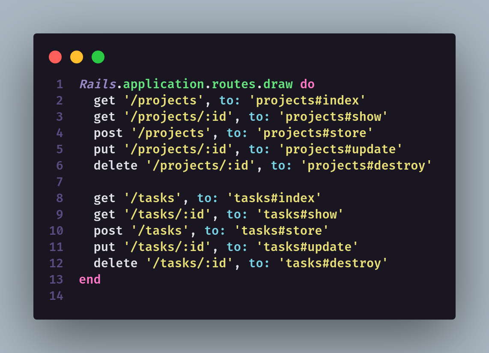

<h1 align="center"> Teste - EasyFarm</h1>

### 🛠 Técnologias utilizadas
- [Ruby on Rails](https://rubyonrails.org/)

### Gems ruby utilizadas
- [rspec-rails]()
- [ffaker]()
- [factory_bot_rails]()

### 🚀 Iniciando a API

#### Clone este reposotório
$ git clone <https://github.com/Guih12/easyfarm-teste>

#### Acesse a pasta do projeto
$ cd teste-easyfarm/api-teste
#### Instale as depências utilzando o comando:
$ bundle install

#### Crie o banco de dados com o comando:
$ rake db:create

#### Crie as migrations utilizando o comando:
$ rake db:migrate

#### Rodar os testes da aplicação
$ rspec spec

#### Inicie o servidor utilizando o comando:
$ rails s

### Endpoints da aplicação
